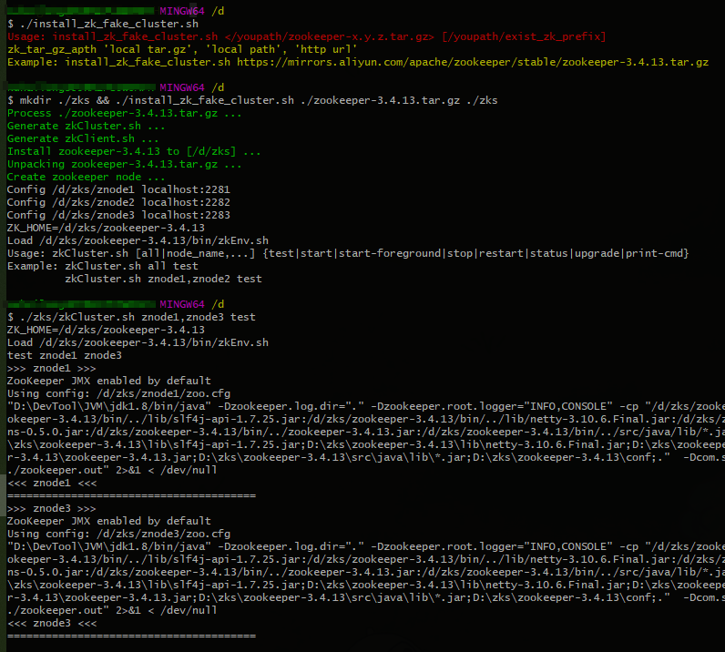
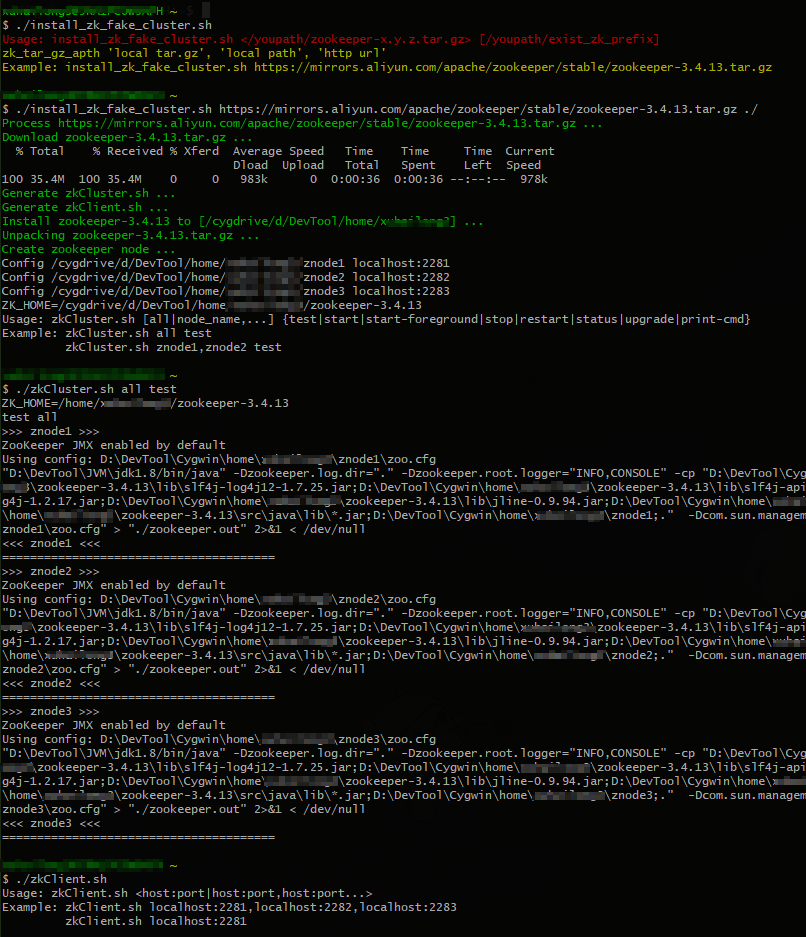

# auto-installer
auto installer script


---
## install_zk_fake_cluster.sh
- Auto Install ZooKeeper Cluster(Fake) for Linux/Unix

### Example:
```bash
# support Linux, macOS, Windows(Cygwin, MSYS, WSL)
./install_zk_fake_cluster.sh https://mirrors.aliyun.com/apache/zookeeper/stable/zookeeper-3.4.13.tar.gz ./

mkdir ./zks && ./install_zk_fake_cluster.sh ./zookeeper-3.4.13.tar.gz ./zks
```

- Git Bash:


- Cygwin:

